# Git Practice Log

Personal log for the 30-Day Git & GitHub Challenge - leading by example alongside the cohort.

---

## Day 1 - Install & Configure

Set up Git identity and initialized the practice repo.

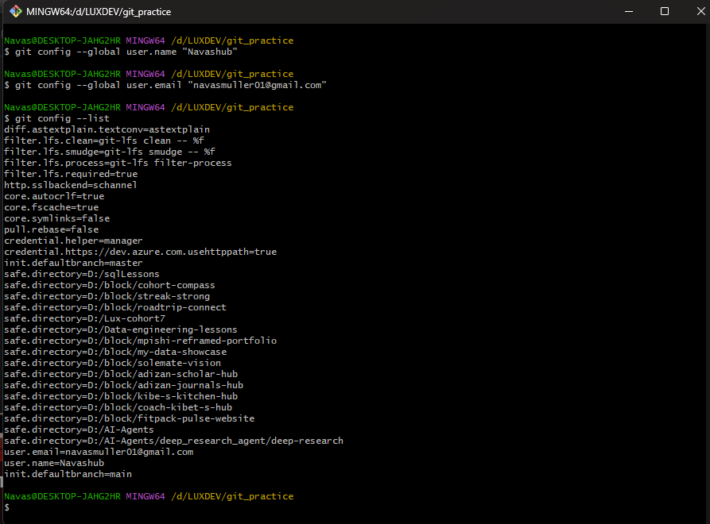

---

## Day 2 - First Commit

Created `log.md`, made my first commit, and reviewed `git log` output.

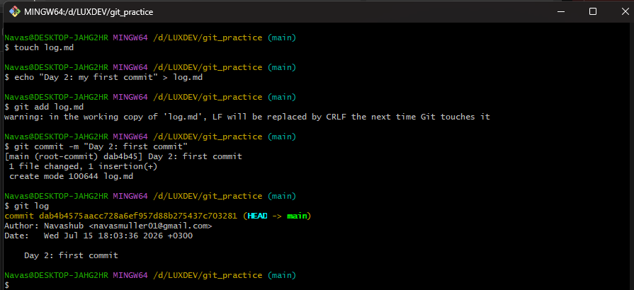

---

## Day 3 - Building the Commit Habit

Made 3 separate, meaningful commits today.

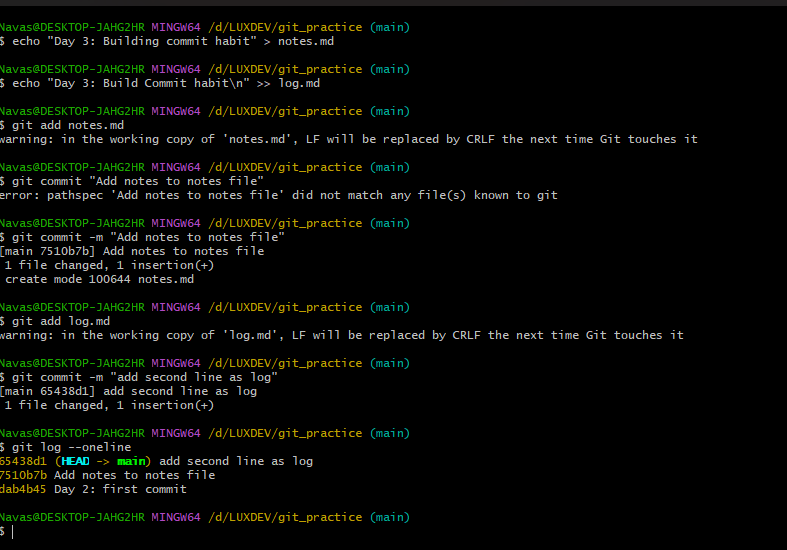

---

## Day 4 - .gitignore

Created a fake `secrets.txt` and `temp/`, added them to `.gitignore`, confirmed a clean `git status`.

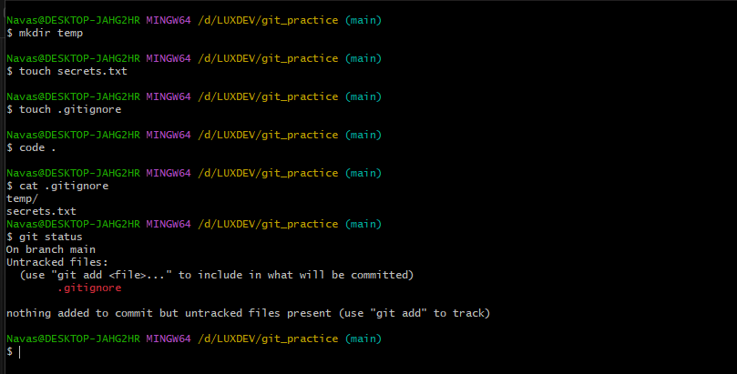

---

## Day 5 - Branching

Created `feature-1`, committed a change on it, then switched back to `main` to see the branch diverge.

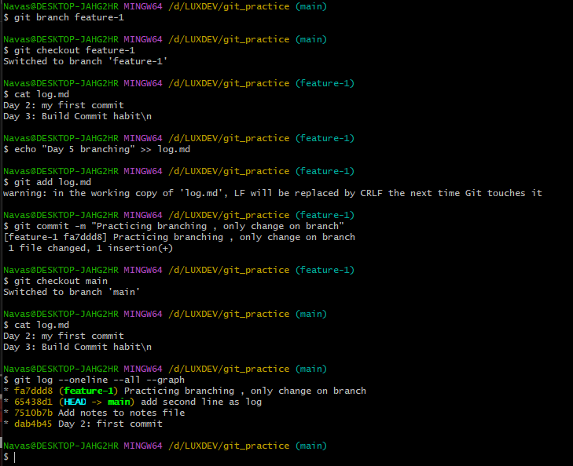

---

## Day 6 - Merge & Conflict

Edited the same line on `main` and `feature-1`, merged, hit a real conflict, and resolved it by hand.

**Before resolving:**

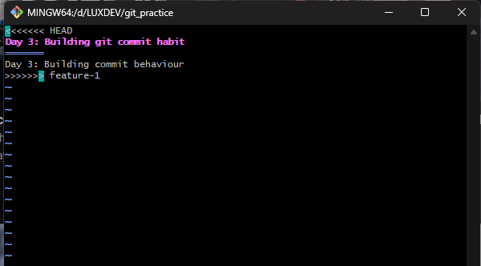

**After resolving:**

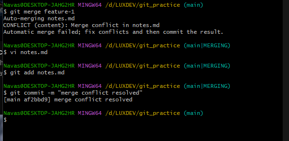

---

## Day 8 - GitHub Setup

Connected the local repo to a new GitHub repository.

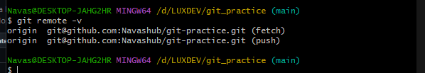

---

## Day 9 - First Push

Pushed local commits to GitHub for the first time and set up branch tracking with origin/main.

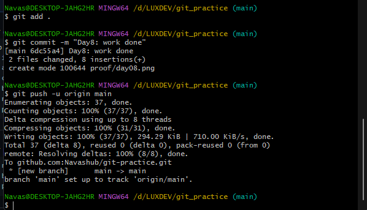

---

## Day 10 - Edit on GitHub, Pull Locally

Edited notes.md directly on GitHub, then pulled it down locally and confirmed the change landed via git pull.

**Edited on GitHub:**

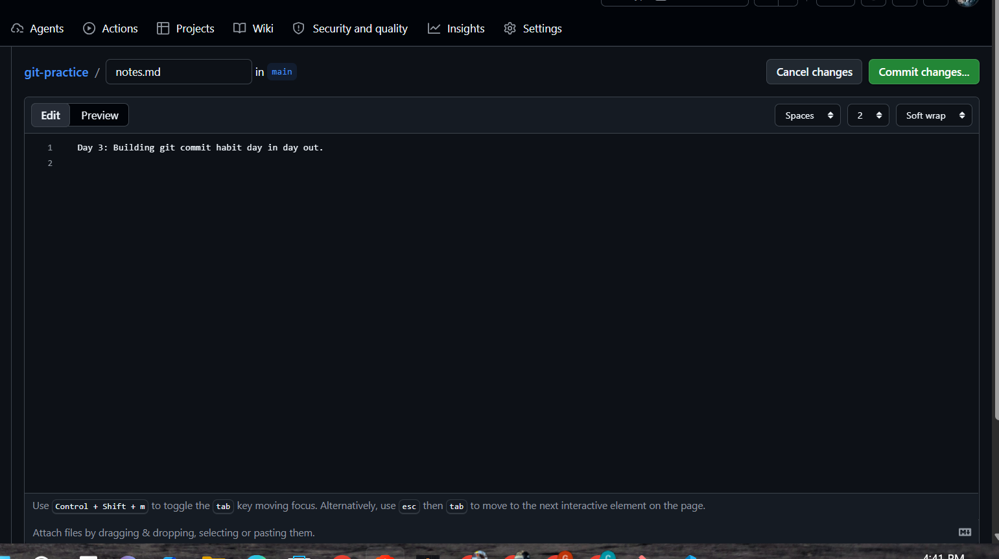

**Pulled locally:**

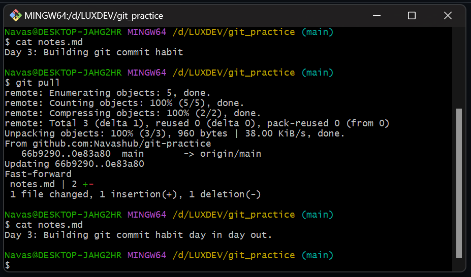

---

## Day 11 - Clone Something

Cloned `neural-maze/production-ocr-course` - a public repo for building/deploying a production OCR pipeline with Rust, vLLM, Redis, and Kubernetes. Noticed it's organized by service (client_rt_consumer, client_rt_producer, server, k8s) rather than by file type - a real multi-service project layout.

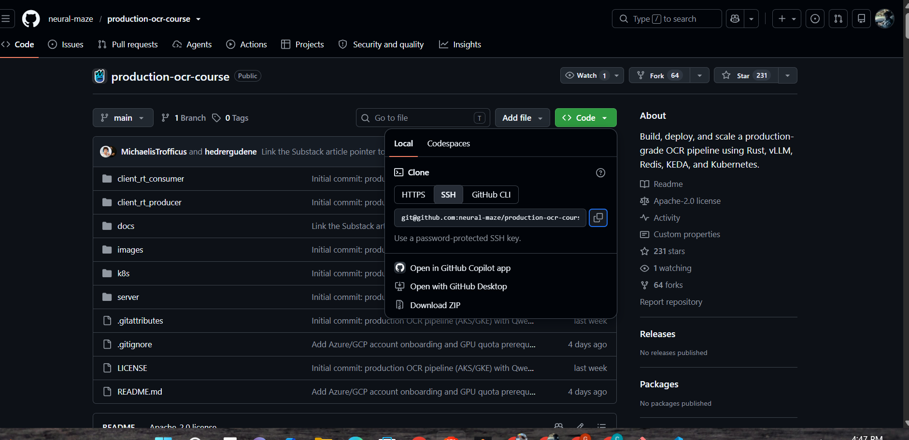

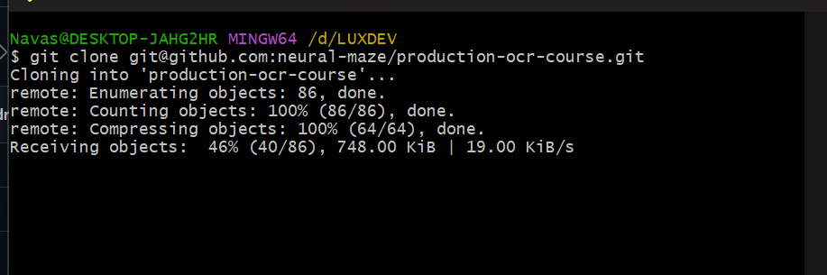

---

## Day 12 - Fork

Forked octocat/Spoon-Knife to my own account, then cloned my fork locally.

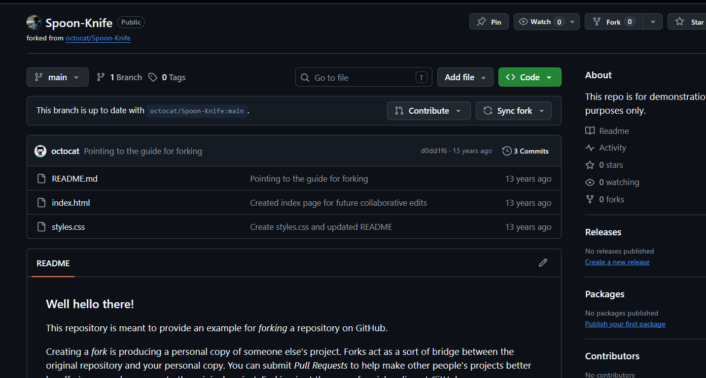

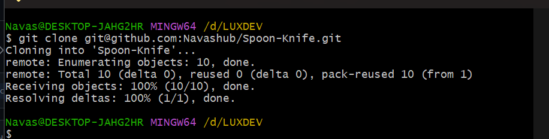

---

## Day 13 - The Push/Pull Rejection Cycle

Edited README.md on GitHub, then made a conflicting local commit without pulling first. Push was rejected as expected. Pulled to merge histories (auto-merged cleanly), then pushed successfully.

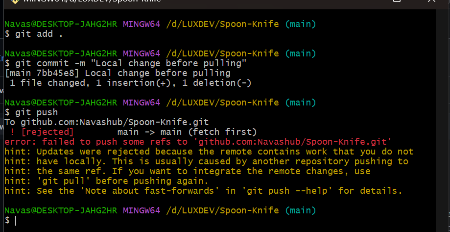

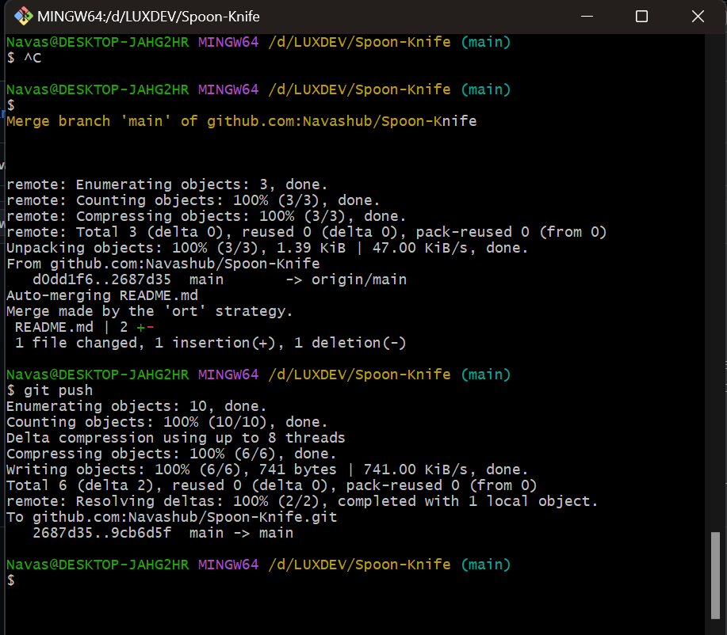

---